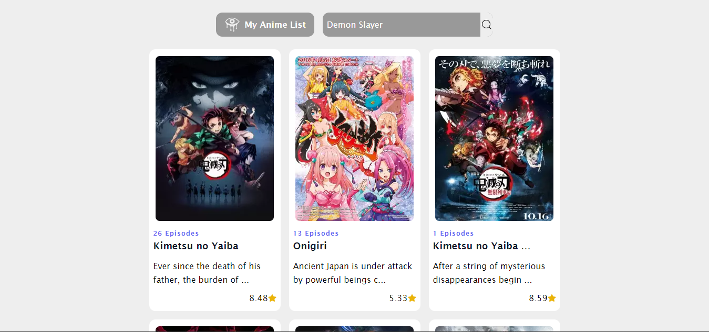

# Mi Aplicación de Animes

Esta es una aplicación web básica que utiliza la API de Jikan (https://jikan.moe/) para mostrar información sobre animes. La aplicación permite a los usuarios buscar animes por nombre y ver información detallada sobre cada uno.

## Características

- **Búsqueda de Animes:** Los usuarios pueden buscar animes por nombre utilizando el campo de búsqueda.
- **Visualización de Información:** Se muestra información básica sobre cada anime, incluyendo puntaje y número de episodios.
- **Interfaz Simple:** La aplicación tiene una interfaz de usuario minimalista y fácil de usar.

## Uso

1. **Instalación de Dependencias:** Ejecute `npm install` para instalar todas las dependencias necesarias.
2. **Inicio de la Aplicación:** Ejecute `npm start` para iniciar la aplicación.
3. **Uso:** Abra su navegador web y navegue a la URL proporcionada por la aplicación para comenzar a usarla.

## Tecnologías Utilizadas

- **React:** El frontend de la aplicación está construido utilizando React.js.
- **Tailwind CSS:** Se utiliza Tailwind CSS para el diseño y estilos de la interfaz de usuario.
- **API de Jikan:** La aplicación consume datos de la API de Jikan para obtener información sobre los animes.

## Capturas de Pantalla

*Figura 1: Página de Inicio de la Aplicación*

*Figura 2: Resultados de Búsqueda de Animes*

## Contribución

¡Las contribuciones son bienvenidas! Si deseas contribuir a este proyecto, por favor sigue estos pasos:

1. Haz un fork del repositorio.
2. Crea una nueva rama para tu contribución (`git checkout -b feature/nueva-caracteristica`).
3. Realiza tus cambios y commitea tus modificaciones (`git commit -am 'Agrega una nueva característica'`).
4. Haz push de tus cambios a tu repositorio (`git push origin feature/nueva-caracteristica`).
5. Abre un pull request en este repositorio.

## Notas Adicionales

- Esta aplicación es un proyecto de aprendizaje personal y está sujeta a cambios y mejoras futuras.
- Para obtener más información sobre cómo utilizar la API de Jikan, consulta la documentación oficial: https://jikan.docs.apiary.io/
